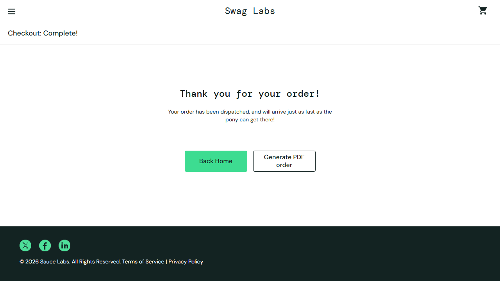

# Anakai — Read, Reason, Act Agents

Two AI agents built for the Anakin Forge hackathon, sharing a common "browse the live web + reason with an LLM" core, extended with a real browser-driven action. Both are powered by [Anakin](https://anakin.io) for their live-web grounding, and the shopping agent additionally uses Anakin's cloud Browser API to perform the checkout itself.

## How Anakin is used

- **Search**: `research_agent/anakin_client.py` calls Anakin's AI-powered Search API (`POST /v1/search`) to ground every answer in current, cited web results instead of the model's training-data priors.
- **URL Scraper**: page content is read via Anakin's managed URL Scraper (`POST /v1/url-scraper/scrape`), which handles JS-heavy pages and anti-bot measures that a plain HTTP fetch can't.
- **Browser API**: the shopping agent's checkout runs inside Anakin's remote, managed cloud browser (`wss://api.anakin.io/v1/browser-connect`, connected to via Playwright's `connect_over_cdp`) rather than a local browser — and the whole session can be **recorded server-side as a WebM video** (`?record=true`) and downloaded afterward, which doubles as literal demo footage of the agent acting.
- A free DuckDuckGo + `requests`/BeautifulSoup fallback keeps both agents working if `ANAKIN_API_KEY` isn't set.

## 1. Research agent (`research.py`)

Reads the live web, reasons through a question, and produces a synthesized, cited report.

1. Plans 2-4 targeted search queries for your question (Gemini).
2. Searches the web for each query (Anakin Search API).
3. Fetches and reads the top results (Anakin URL Scraper).
4. Synthesizes a cited answer from the collected content (Gemini).
5. Checks its own answer for gaps and, if needed, runs one more follow-up search before finalizing.

```bash
python research.py "What are the latest developments in solid-state batteries?"

# save to a file, and read more sources per query
python research.py "your question" --output report.md --sources 6
```

Sample output: [examples/sample_research_report_anakin.md](examples/sample_research_report_anakin.md)

## 2. Shopping agent (`shop.py`)

Goes beyond research: it reads real market context from the web, reasons about the best matching product from a **live product catalog**, then **takes a real action** — adds the item to cart and completes checkout end-to-end inside Anakin's cloud browser, leaving a screenshot (and optionally a recorded video) as proof.

1. Searches the live web for market context on what you want (Anakin Search + URL Scraper).
2. Logs into a live storefront and reads the current in-stock catalog (name, price, description) via Anakin's Browser API.
3. Reasons about the single best match for your want, given the market context and catalog (Gemini).
4. Acts: drives the remote browser to add the chosen product to cart and complete checkout, then saves a confirmation screenshot.

The demo storefront is [saucedemo.com](https://www.saucedemo.com/), built by Sauce Labs specifically for browser automation testing — real retailers (Amazon, etc.) aggressively block bots, which would make a live demo unreliable. No real payment or personal data is involved.

```bash
python shop.py "a durable backpack for daily commuting under 40 dollars"

# customize the checkout details and screenshot path
python shop.py "your want" --first-name Jane --last-name Doe --zip 10001 --screenshot proof.png
```

Sample run: asked for "a lightweight jacket for cool weather under 50 dollars" — the agent picked the Sauce Labs Fleece Jacket ($49.99) and completed checkout:



### Recording a demo

With `ANAKIN_API_KEY` set, pass `--record` to have Anakin record the entire remote browser session as a WebM video and download it automatically once checkout completes:

```bash
python shop.py "a durable backpack for daily commuting under 40 dollars" --record --video demo.webm
```

Without an Anakin key, pass `--headed` instead to watch a local, visible browser window click through add-to-cart and checkout live (useful for a screen recording):

```bash
python shop.py "a durable backpack for daily commuting under 40 dollars" --headed
```

`--slow-mo` (default `300`, only applies with `--headed`) adds a delay in milliseconds between browser actions so each click is easy to follow on camera.

## Web UI

Both agents can also be launched from a browser instead of the CLI — a single page with a tab for each agent, a live streaming console showing each step as it happens, and the final report/order (with the screenshot and video) rendered inline.

```bash
python run_webapp.py
```

Then open http://127.0.0.1:8787. Under the hood it's a small FastAPI app (`webapp/server.py`) that runs each agent in a background thread and streams its `log()` callback over a WebSocket to the page in real time.

## Setup

```bash
pip install -r requirements.txt
python -m playwright install chromium   # only needed as a fallback if ANAKIN_API_KEY isn't set
cp .env.example .env
# edit .env and set GEMINI_API_KEY=your-key-here
# and ANAKIN_API_KEY=your-key-here (free signup at anakin.io, 300 free credits)
```

Get a free Gemini API key at https://aistudio.google.com/apikey

## Project layout

```
research_agent/
  anakin_client.py # Anakin Search, URL Scraper, and Browser API client
  search.py        # web search (Anakin, falls back to DuckDuckGo)
  fetch.py         # fetch + clean page text (Anakin, falls back to requests + BeautifulSoup)
  report.py        # markdown report formatting (research agent)
  agent.py         # research agent orchestration
  shop_browser.py  # browser automation against the live demo storefront (Anakin cloud browser, falls back to local Playwright)
  shop_agent.py    # shopping agent orchestration (research -> reason -> act)
webapp/
  server.py        # FastAPI app: serves the UI and streams agent progress over WebSockets
  static/index.html # single-page frontend (tabs, live console, results)
research.py         # research agent CLI
shop.py             # shopping agent CLI
run_webapp.py        # launches the web UI
```
